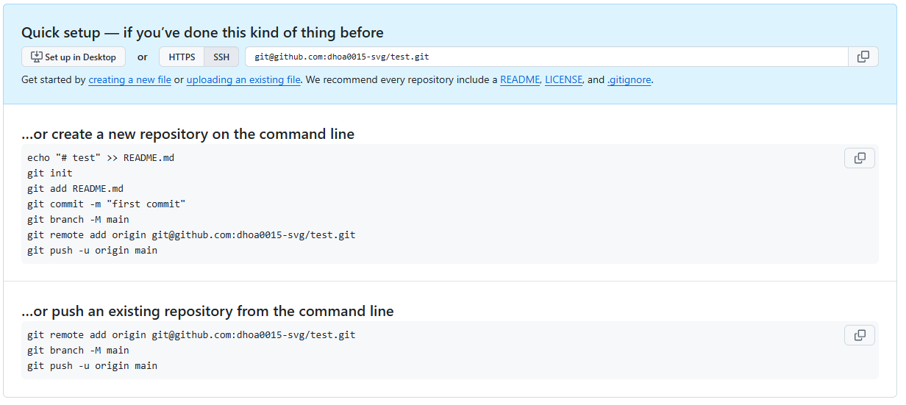
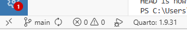

## **1. Set up the repository locally on my computer**

Suppose you have an existing local directory that is not yet under version control, and you want to start tracking it. For this project, I created a new directory named **Assignment 2**.

First, I opened *RStudio* and created a new project in this existing directory. This generated an `Assignment 2.Rproj` file, fulfilling the requirement to set up an R Project. 

For the remainder of the workflow, I transitioned to the **Positron** IDE. Upon opening the` Assignment 2` directory in Positron, the only existing file was the `.Rproj` file. I then created a new Quarto document, saved it as `example.qmd`, and rendered the file to generate the corresponding HTML output, which name is `example.html`

## **2. Initialize a local Git Repository and push to GitHub**

Normally, in order to set up one project that is reproducible, we tend to follow these following steps:

- Create a GitHub repo
- Clone the repo locally
- Move all the files and folders from your existing project into this folder
- Stage, commit, push

However, to ensure a streamlined version control workflow and avoid redundant directory structures, it is often more efficient to initialize a Git repository locally before pushing it to a remote platform like GitHub. Because cloning a remote repository downloads an entirely new directory onto your local machine, doing so can sometimes lead to awkwardly nested project folders. By initializing Git in your local workspace first, you can seamlessly integrate version control into your existing project structure before syncing it with the remote server.

Github even explain on how to setup this repo using these git commands: 
```{r}
#| fig-cap: "Github instruction for initialising Git repository from local to remote"
#| out-width: "80%"
#| fig-align: "center"
#| echo: false


```

::: {.callout-warning title="Always making sure you are in the correct directory"}

Whenever you open your terminal, the very first thing you need to establish is your current location. You can do this by typing `pwd`, which stands for `print working directory`. This outputs your exact path in the computer Make sure you are in the right folder for your project.

If you want to look around and see what folders are available to you, type `ls` to list the contents of that directory and how they organize in your computer.  

Once you are oriented, use the `cd` (change directory) command to navigate step-by-step into your specific project folder.
:::

### Step 1: Command `git init`

First step to do to make our local file become a tracked git repository is to use `git init`

> **Syntax:** `git init`

This command will transform the current, standard directory into an empty Git repository so you can start saving versions of your files. It creates a hidden directory inside the project folder name `.git`

::: {.callout-tip title="When to use"}
Use this when you are starting a brand new project and want to start tracking its files, or when you want to add version control to an existing un-tracked folder.
:::

### Step 2: Commnand `git add`

Now that your repository is initialized, the next step is to tell Git which files you want it to track. In our case, this includes your `.Rproj` file, your Quarto (.qmd) scripts, the generated .html reports, and any associated configuration files.

> **Syntax:** `git add .`

It takes your modified or newly created files and moves them into the staging area. Think of this like you are packing your files and getting them ready for the commit, but they haven't been committed yet.

```bash
$ git add <your_file_name>
# To see the result, you run `git status`:

$ git status
# Changes to be committed:
#   (use "git rm --cached <file>..." to unstage)
#         new file:   analysis.qmd
```
### Step 3: Command `git commit`

Once your files are in the staging area, you need to permanently record these changes in your repository's history. This creates a snapshot of your project exactly as it looks right now.

> **Syntax:** `git commit -m "your_commit_message"`

```bash
$ git commit -m "Initial first commit in local repository"
```

::: {.callout-tip title="Best practices for commits"}

Always use the `-m` flag to write your message directly in the terminal. If you forget it, Git will open a text editor - Vim editor.

Keep your commit messages short but descriptive, always be specific and consider subjects of files you are commiting.
:::

### Step 4: Command `git branch`
Historically, git named the default branch master. To this day, the standard across the tech industry and GitHub is to name the primary branch main. We need to make sure our core branch name match this standard.

> **Syntax:** `git branch -M main`

This command forces Git to rename your current active branch to main.

```bash
$ git branch -M main
# If you want to check it worked, type:
$ git branch
# * main
```

### Step 5: Command `git remote`

Right now, your repository only exists locally on your computer. To back it up and share it, you need to connect your local repository to the empty repository you created on GitHub. This command tells local Git to add a remote connection to this local repository.

> **Syntax:** `git remote add origin "your_git_ssh_key"`

### Step 6: Command `git push`

The final step is to actually upload your committed files from your computer to your GitHub repository.

> **Syntax:** `git push -u origin main`

This command pushes your code up the `origin` connection we just established, specifically onto the `main` branch.

::: {.callout-warning title="Why do we need a `-u` flag?"}
The `-u` flag stands for `upstream`. You only need to type this the very first time you push a new branch. It links your local main branch to the GitHub main branch. For future updates, you can simply type git push and Git will remember where to send it.
:::

## **3. Modify on new branch**

### Create `testbranch` and make some changes in `example.qmd`
To work on new features safely without affecting your main project, you should create a new branch. A branch is essentially an alternate timeline or an isolated workspace for your code.

> **Syntax:** `git switch -c "newbranch_name"`

This command actually does two things at once: it creates the new branch, and it immediately switches you into it, or in another word, it moves the repository `HEAD` to this branch as well.

::: {.callout-tip title="Check if it works"}
You can confirm this command actually worked by type `git branch` in the terminal. This command shows a list of branches and point to which branch are you in currently

```bash
$ git switch -c testbranch
# Switched to a new branch 'testbranch'
$ git branch
#  format
#  main
#* testbranch
```
:::

There are other ways to create branches and navigate between branches as well. For example, one more command that does exactly what the previous one did is `git checkout -b "branch_name"`. Additionally, you can do it step-by-step by first, create a new branch, and then swith to that branch to make changes on that newly created branch.

```bash
$ git branch "branch_name"
$ git switch "branch_name"
# Switched to branch 'branch_name'
```
Once you have modified your file inside the `testbranch`, it is time to permanently record your progress. To ensure your updates are saved both locally on your computer and remotely on GitHub, you must complete the standard `stage > commit > push` workflow.

Execute the following commands to complete this process:
```bash
$ git add example.qmd
$ git add example.html

$ git commit -m "Create new testbranch and add instruction for these steps"

$ git push -u origin testbranch
# Enumerating objects: 13, done.
# Counting objects: 100% (13/13), done.
# Delta compression using up to 8 threads
# Compressing objects: 100% (9/9), done.
# Writing objects: 100% (9/9), 5.33 KiB | 1.78 MiB/s, done.
# Total 9 (delta 6), reused 0 (delta 0), pack-reused 0 (from 0)
# remote: Resolving deltas: 100% (6/6), completed with 2 local objects.
# remote: 
# remote: Create a pull request for 'testbranch' on GitHub by visiting:
# remote:      https://github.com/dhoa0015-svg/Assignment2_DucHoang_36558966/pull/new/testbranch
# remote:
# To github.com:dhoa0015-svg/Assignment2_DucHoang_36558966.git
#  * [new branch]      testbranch -> testbranch
# branch 'testbranch' set up to track 'origin/testbranch'.
```

### Create new folder and use `--amend`

To create a new folder inside our project repository, we can either use our computer's file explorer manually, or we can create it directly using the terminal. The terminal command to make a new directory is `mkdir`
> **Syntax:** `mkdir "file_name"`

```bash
$`mkdir data`
#     Directory: C:\Users\ducho\OneDrive\MBA S1 Y1\ETC5513 - Collaboration\Assignment 2
# Mode                 LastWriteTime         Length Name
# ----                 -------------         ------ ----
# d-----         5/10/2026   1:54 AM                data
```
Afterward, we simply need to copy or move our data files from Assignment 1 into this newly created data folder.

Sometimes, right after you finish the workflow and changes were commited, you realize you forgot something important. Instead of creating a messy, separate commit just for the forgotten files, you can use git command contaning `--amend` to moderately add more details to your previous commit.

> **Syntax:** `git commit --amend --no-edit` -> `git push --force origin "branch_name"`

```bash
# First we stage our changes, along with adding new data folder and data file, i have modified qmd and html file as well,
# so i have also added these to the files that need amended.
$ git add example.qmd
$ git add example.html
$ git add data/

# Amend these previous changes
$ git commit --amend --no-edit
#  3 files changed, 264 insertions(+), 10 deletions(-)
#  create mode 100644 data/36558966_Duc Hoang.csv

# Force push all these changes to remote repo
$ git push --force origin testbranch
```

::: {.callout-warning title="Why do we need a `--force` flag?"}
Because when we amended a commit that we had already pushed to GitHub, our computer's timeline no longer matches GitHub's timeline. A standard git push would be rejected. We must use the `--force` flag to explicitly tell GitHub to overwrite the old commit history with our newly amended version. 
:::

## 4. **Merge branch and resolve merge conflicts**
### Modify file in main branch

When it comes to merging branches into the main branch, this is one of Git's most powerful features as it allows users to work on different versions of a project simultaneously. Once we are satisfied with the changes on a branch, we can merge it back into `main` to incorporate those changes into the primary codebase.

::: {.callout-warning title="Always check which branch you are working on"}
Because Git allows you to switch between branches, it is important to always be aware of which branch you are currently on before making any changes. Working on the wrong branch by mistake can lead to messy, unintended modifications that are difficult to untangle.

If you are using Positron, you can always check your current branch in the **bottom-left corner** of the editor window.
```{r}
#| fig-cap: "Positron branch navigator"
#| out-width: "80%"
#| fig-align: "center"
#| echo: false


```
:::

First, switch back to the `main` branch. This is necessary so that our next changes are recorded on `main` and not on `testbranch`.
```bash
$ git checkout main
```
Open `example.qmd` and edit the same lines that were changed on testbranch, but write something different. The key is that both branches have touched the same part of the file, what will trigger a conflict.

After saving, stage and commit the change:
```bash
$ git add example.qmd
$ git commit -m "Update title on main branch"
```

Then push to the remote so the `main` branch on GitHub also reflects this change:
```bash
git push origin main
```
At this point, both `main` and `testbranch` have diverged, where they share a common ancestor commit but each has a different version of example.qmd. Git knows about this but has not yet tried to reconcile the two.

### Merge `testbranch` onto `main`

::: {.callout-tip title="Merge branches onto main"}
Make sure you are still on main branch when merging alternative branches onto main.
:::

> **Syntax:** `git merge <branchname>`

Because both branches edited the same lines, Git cannot auto-merge them. It will print a message confronting about there was a conflict trying to merge these two:

```bash
$ git merge testbranch
# Output:
Auto-merging example.html
CONFLICT (content): Merge conflict in example.html
Auto-merging example.qmd
CONFLICT (content): Merge conflict in example.qmd
Automatic merge failed; fix conflicts and then commit the result.
```

#### What the conflict markers look like

when the conflict ahppen, `example.qmd` file will display in any text editor. Git has annotated the conflicting section with special markers:

```
<<<<<<< HEAD
Modification on main branch: Section 4. Merge branch and resolve merge conflict
=======
Modification on testbranch: Section 3: Modify on new branch
>>>>>>> testbranch
```

- Everything between `<<<<<<< HEAD` and `=======` is what exists on `main` (your current branch).
- Everything between `=======` and `>>>>>>> testbranch` is what exists on `testbranch`.

#### Resolving the conflict

Edit the file to keep the version you want, this act can enable you too: accept changes with just click, or manual change evrythign if you want. (or write a new combined version), and **delete all three marker lines**. after you are happy with your changes, Save the file. Now tell Git the conflict has been resolved by staging the file:

```bash
git add example.qmd
```

Running `git status` again confirms there are no more unmerged paths:

```bash
git status
```

#### Verifying on GitHub

Navigate to your repository on GitHub. You will see:

- The commit history on `main` now includes commits from both branches, plus the new merge commit at the top.
- The network graph shows the two branches diverging and then converging back into `main`.
- The file `example.qmd` on GitHub reflects the resolved version you chose.

This confirms that the conflict was identified, resolved locally, and the clean merged result has been successfully published to the remote repository.

Merge conflicts are a normal part of collaborative version control. Understanding how to read conflict markers, choose the correct resolution, and complete the merge cleanly is an essential Git skill. The workflow here — `merge → identify conflict → edit file → add → commit → push` is the same regardless of how large or complex the conflict is.
